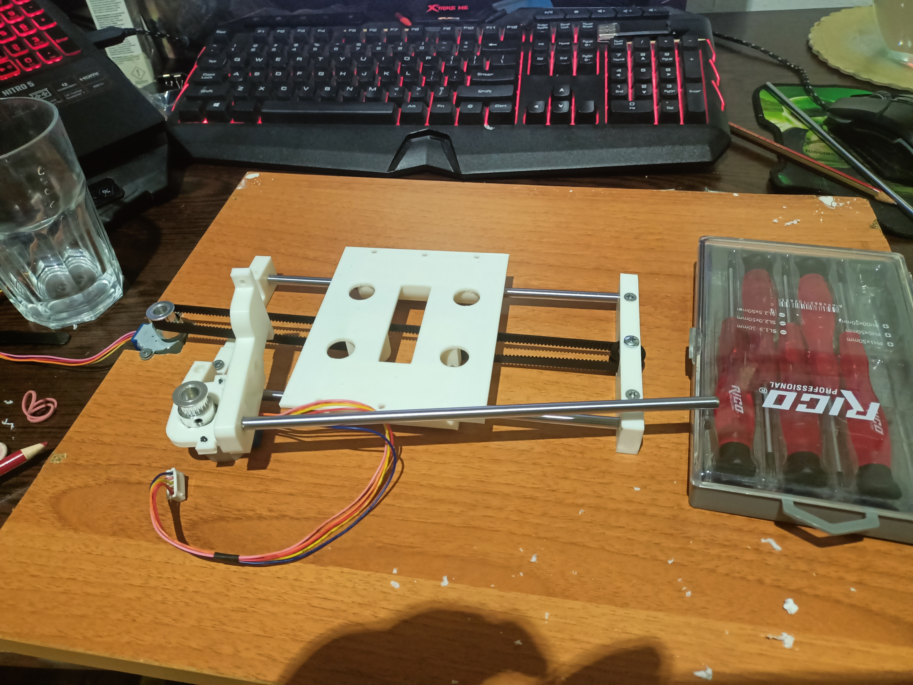
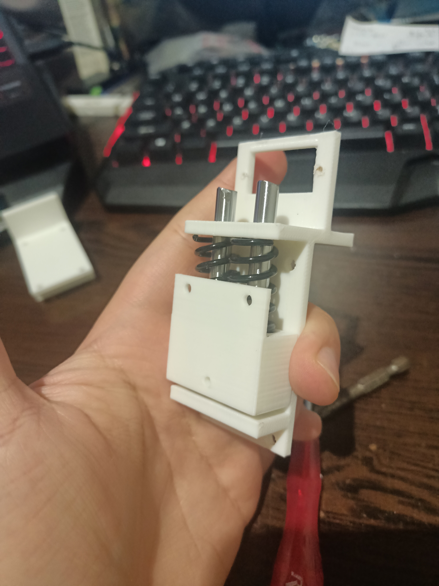
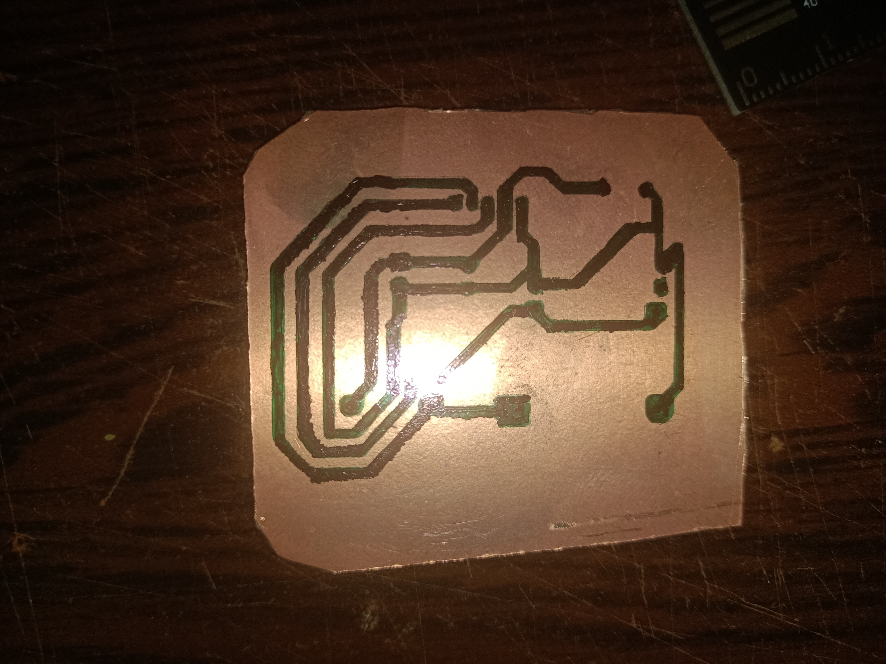
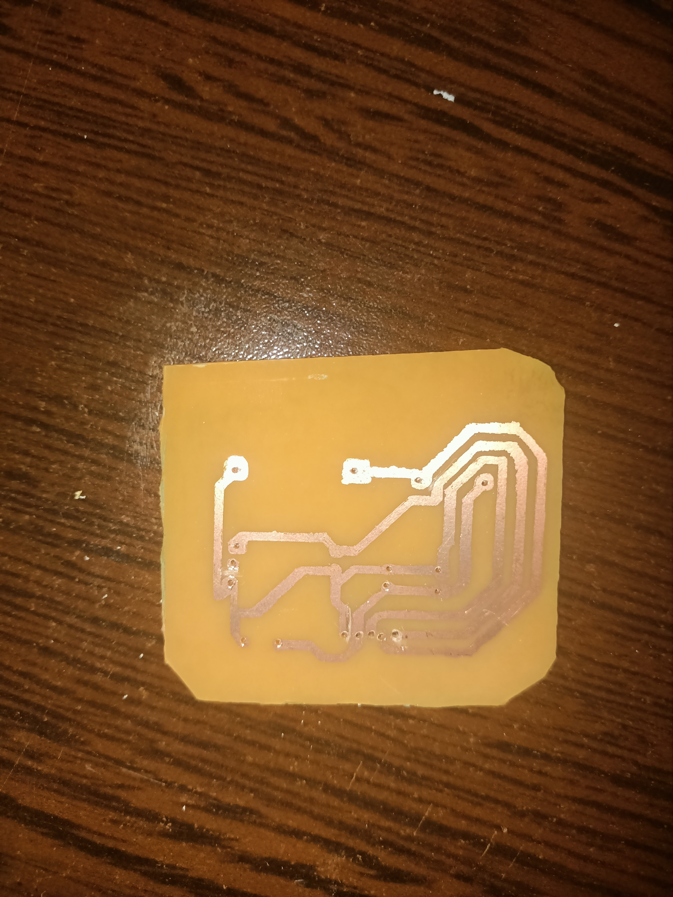

# Mini-CNC-Plotter_DIY

## 📹 Video

[YouTube Video Link](https://youtu.be/wrf7VYjFJH0)

---

## Hakkında

Bu projede 3D yazıcı ile yapmış olduğum mini CNC plotter hakkında bilgi vermek istiyorum.
Bu projeyi yapmamdaki asıl amaç, bakır plaketler kullanarak baskı devre (PCB) yapabilmekti.

---

## Kullanılan Elektronik Bileşenler

- Arduino Nano
- 2x 28BYJ-48 Step Motor
- 1x Servo Motor
- 2x ULN2003 Sürücü Modülü

---

## Parça Listesi

- 4x 6mm çaplı, 220mm uzunluğunda lineer rod
- 2x 6mm çaplı, 6mm uzunluğunda lineer rod
- 8x Lineer ray
- GT2 Kayış (en az 1 metre, 2 adet almanızı öneririm)
- M3 vida ve somunlar
- 2x GT2 rulman
- 1x GT2 dişli kasnak

---

## Yazılım

Arduino'ya yüklenecek GRBL kodu şu repodan bulunabilir:
[GRBL-28byj-48-Servo](https://github.com/ruizivo/GRBL-28byj-48-Servo)

### ⚠️ Önemli: Derleme Hatası ve Çözümü

GRBL versiyon uyumsuzluğundan (0.9 ve 1.1) kaynaklanan bilinen bir hata mevcuttur.
Arduino IDE üzerinden derlerken aşağıdaki hatayı alabilirsiniz:
```
'stepper_t' has no member named 'dir_outbits'
```

Bu hata, eski GRBL sürümüne ait bir kod satırının GRBL 1.1'de artık kullanılmamasından kaynaklanmaktadır.

**Çözüm:**

1. Arduino kütüphaneler klasörüne gidin: `libraries > grbl > stepper.c`
2. `stepper.c` dosyasını bir metin editörü (Notepad++, VS Code vb.) ile açın
3. Aşağıdaki satırı bulun ve yorum satırı haline getirin ya da tamamen silin:
```
// st.dir_outbits = dir_port_invert_mask;
```

Bu işlemden sonra kod sorunsuz şekilde derlenecektir.

>  Bu çözüm @Chihuahua_insano tarafından paylaşılmıştır.

---

## G-Code Oluşturma

1. Kullanmak istediğiniz görseli bulun.
2. **Inkscape** programını açın, `Path > Trace Bitmap` bölümünden **Speckles**, **Smooth Corners** ve **Optimize** değerlerini `0` yaparak bitmap izini çıkarın.
3. Elde ettiğiniz vektörü sayfa ayarlarından `100mm x 100mm` gibi uygun bir boyuta getirip **SVG** olarak kaydedin.
4. [jscut.org](https://jscut.org) sitesine gidin, SVG dosyanızı ve repodaki `settings.jscut` ayar dosyasını yükleyin. Ardından G-code'a çevirip bilgisayarınıza indirin.
5. jscut 3 eksenli (3 step motor) G-code ürettiğinden, servo motorumuzla uyumlu hale getirmek için repodaki `gcode_converter.py` scriptini çalıştırın. Bu script:
   - Z eksenini servo komutlarına dönüştürür
   - Servo bekleme süresi ve yön ayarlarını yapmanıza olanak tanır
6. Dönüştürülen G-code'u **UGS Platform** (`win64-ugs-platform-app-2.1.14`) ile plotterınıza göndererek çizimi başlatın.

> **Not:** `settings.jscut` dosyasındaki **Units**, **Thickness**, **Z Origin** ve **Clearance** değerlerini değiştirirseniz `gcode_converter.py` scripti beklendiği gibi çalışmayabilir.

---

## Görseller

| | |
|---|---|
|  |  |
|  |  |
|  | |
